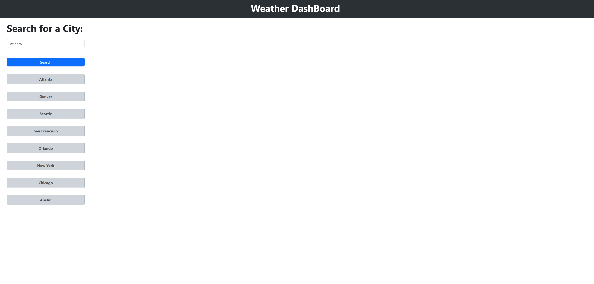
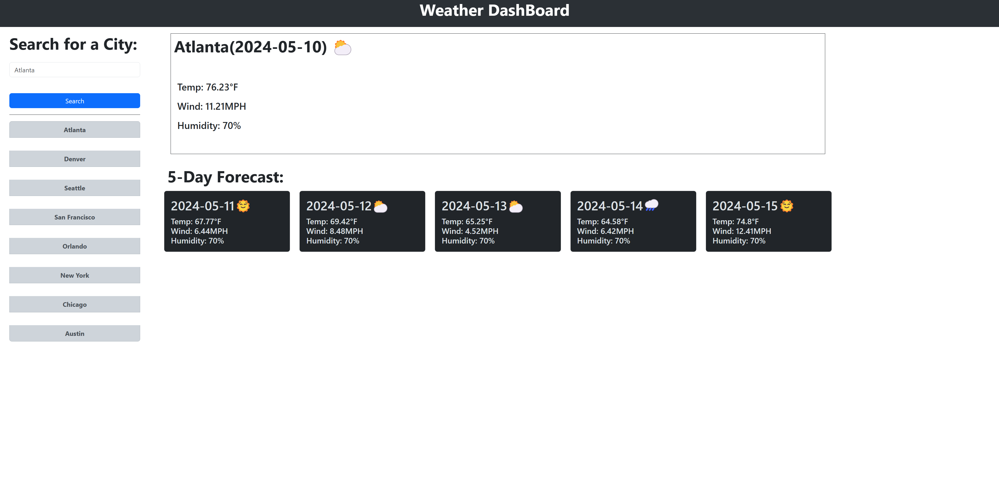

# 06_Weather_DashBoard

## Description

A challenge to build a weather dashboard that will run in the browser and feature dynamically updated HTML and CSS.

## Deployed Application Link

[Check it live by clicking here](https://renzsupnet.github.io/06_Weather_DashBoard/)

## Goal

- To be able to use localStorage to store persistent data 
- To be able to dynamically create and stylize html elements using javascript
- To be able to query the openweather api using user inputs
- To be able to display the current and 5 day weather forecast dynamically using the api

## Usage

Either input a City in the search field or press one of the cities shown on the list to receive the weather forecast. A previous city search list element
will be dynamically created and updated as you search more cities up to a maximum of 8 cities.

## Screenshots

A Screenshot of the homepage with no results.

A Screenshot of the weather dashboard after querying the OpenWeather api

## Credits

Thanks to OpenWeather for providing a weather api!

OpenWeather Api - https://openweathermap.org/api

